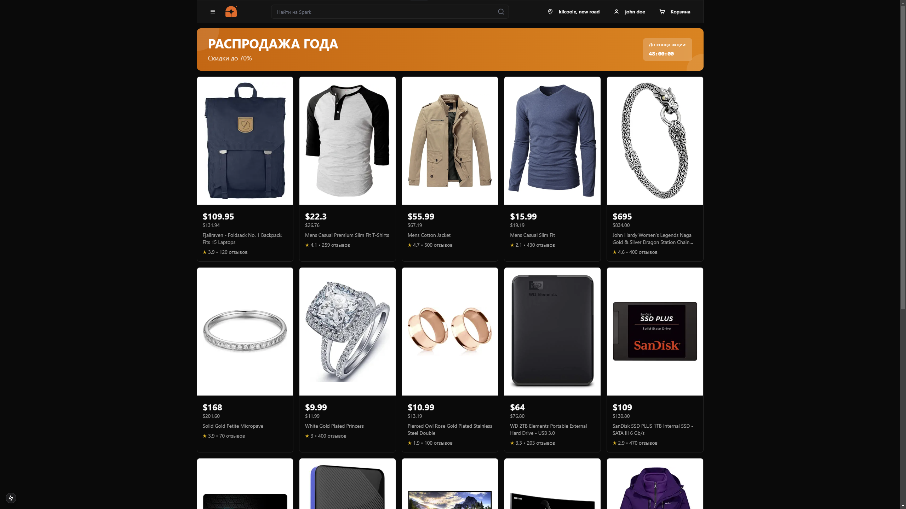

# Spark - Online Shop


Spark is a modern online shop built using Next.js and other cutting-edge technologies. This project provides users with the ability to browse and purchase products with a user-friendly interface and a host of features.

## 🚀 Technologies

- **Next.js**: A React framework for building server-side and static web applications.
- **React**: A library for building user interfaces.
- **TypeScript**: A programming language that extends JavaScript capabilities.
- **Tailwind CSS**: A utility-first CSS framework for creating responsive designs.
- **NextAuth.js**: A library for authentication in Next.js applications.
- **Zod**: A library for data validation.
- **React Hook Form**: A library for managing forms in React.
- **Lucide Icons**: A set of icons for React.

## 📦 Installation and Setup

1. **Clone the repository:**

   ```bash
   git clone https://github.com/yourusername/spark.git
   cd spark
   ```

2. **Install dependencies:**

   ```bash
   npm install
   ```

3. **Run the development server:**

   ```bash
   npm run dev
   ```

4. **Open [http://localhost:3000](http://localhost:3000) in your browser to see the result.**

## 📚 Project Structure

- **`src/app`**: Main pages and components of the application.
- **`src/components`**: Reusable UI components.
- **`src/services/api`**: API services for interacting with external data sources.
- **`src/types`**: TypeScript type definitions.
- **`src/lib`**: Utilities and helper functions.

## 🌟 Features

- **Registration and Authentication**: Users can create accounts and log in.
- **Product Browsing**: Product catalog with category filtering.
- **Shopping Cart**: Add products to the cart and proceed to checkout.
- **Responsive Design**: Supports various devices and screen sizes.

## 📸 Examples

### Screenshot



### GIF


---

We hope you enjoy using Spark! If you have any questions or suggestions, feel free to reach out to us.
